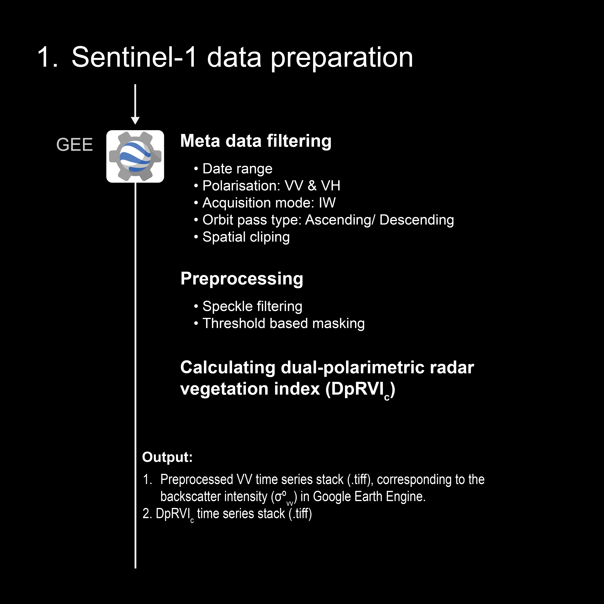
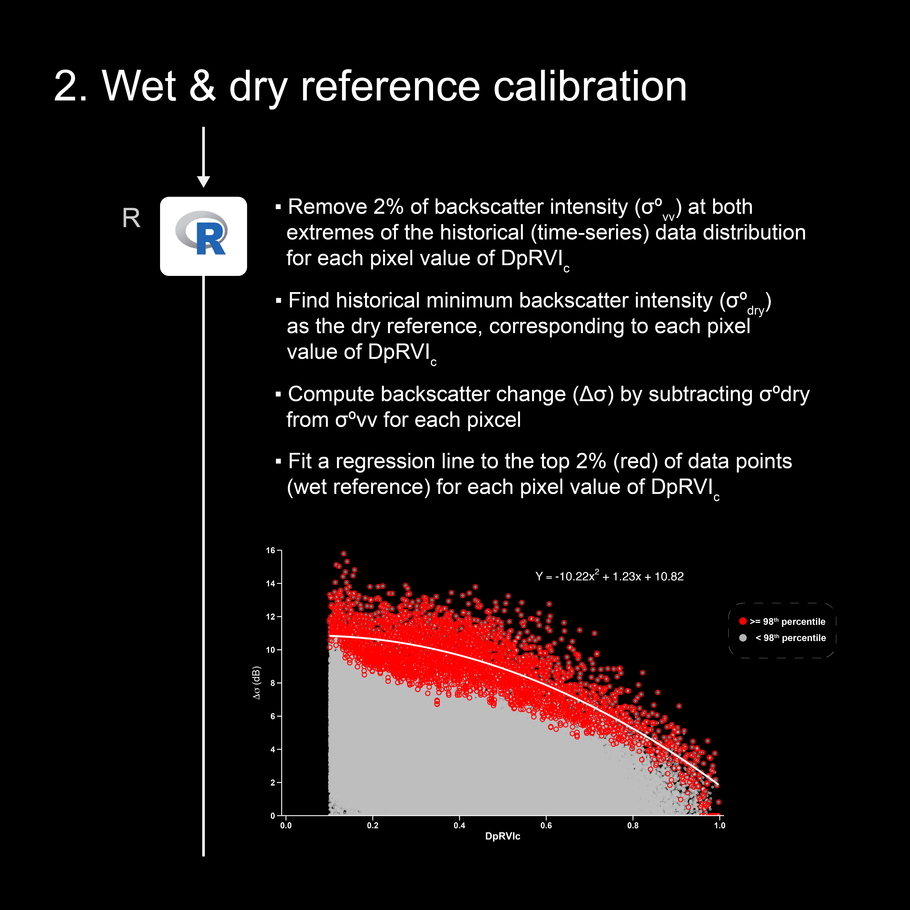
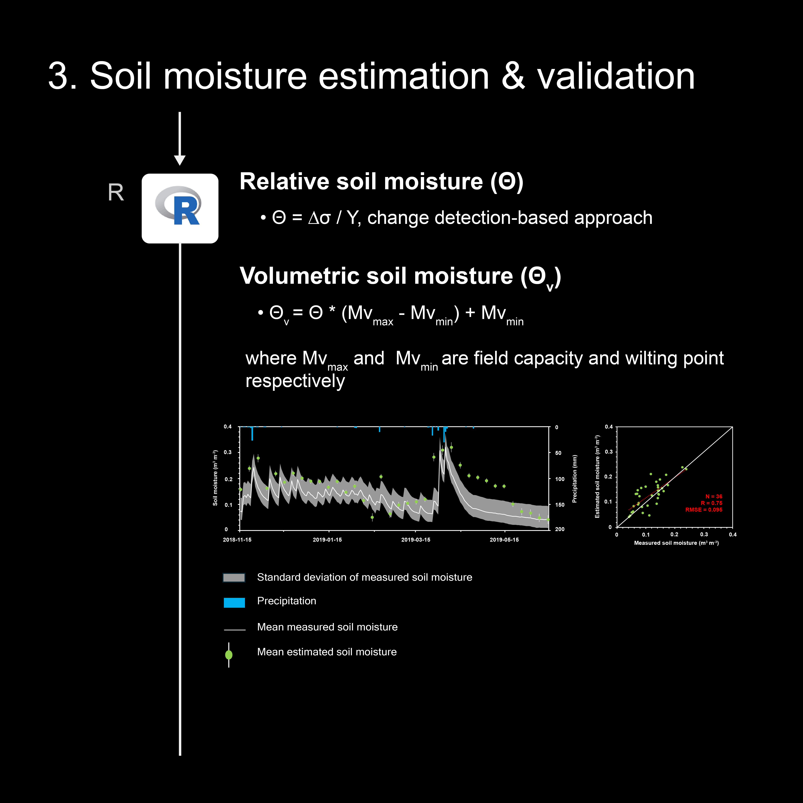
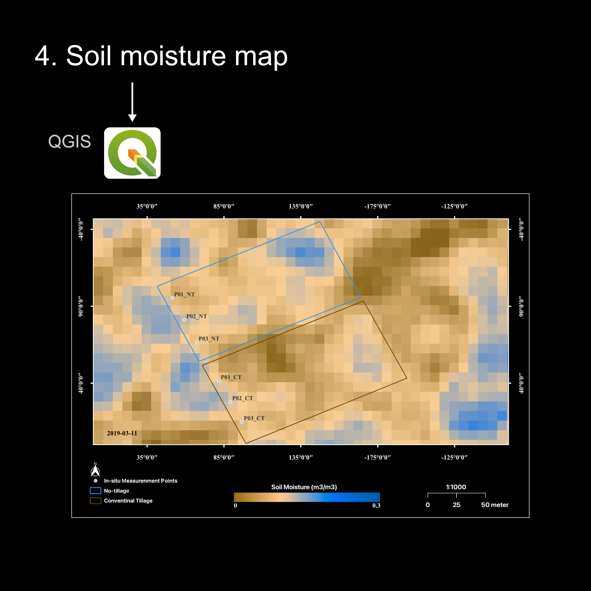

# Sentinel-1 Soil Moisture Estimation 

## Overview

This repository outlines a step-by-step workflow for estimating soil moisture at the field scale using Sentinel-1 Ground Range Detected (GRD) Synthetic Aperture Radar (SAR) data. The approach combines the Dual-Polarization Radar Vegetation Index (DpRVIc) with a change detection-based algorithm (CDA) for better accuracy during cropping period.

For a detailed explanation of the methodology, please refer to the research paper by [Bhogapurapu et al. (2022)](https://doi.org/10.1016/j.asr.2022.03.019).

### Key Findings

**Model Performance**: Correlation coefficient (r) = 0.75, RMSE = 0.095 m3 m-3.

---

## Workflow

### 1. Preparing Sentinel-1 Data Using Google Earth Engine

This section guides you through preprocessing Sentinel-1 GRD SAR scenes (VV/VH, 10m resolution) with [Google Earth Engine](https://www.sciencedirect.com/topics/earth-and-planetary-sciences/google-earth-engine). The process involves:

- **Calculating the Dual-Polarization Radar Vegetation Index (DpRVIc)** to reduce vegetation influence on SAR backscatter intensity.
- **Preparing the backscatter intensity** in vertical-vertical polarization (VVdB).

For your convenience:

- [Access the Google Earth Engine code for Step 1](https://code.earthengine.google.com/7c1e52eaa51eb2c931434f62b1e3bba6)

- [Visit the Google Earth Engine App](https://ee-eranwari.projects.earthengine.app/view/sentinel-1-polarimetric-explorer-morocco) to filter Sentinel-1 SAR imagery by date, visualize various polarimetric descriptors, and download the processed image collection in GeoTIFF format for additional analysis if you prefer not to use the code.

### 2. Dry and Wet Reference Calibration

In this step, you will calculate:

- **Dry Reference Backscatter Intensity (σ°dry)**
- **Backscatter Change (Δσ)**
- **Maximum Backscatter Change (Δσmax)** by preforming pixel based regression analysis between the backscatter change (Δσ) and the Dual-Polarization Radar Vegetation Index (DpRVIc)

This step is implemented using an [R-script](R-scripts/step2-wet-dry-reference-calibration.R), which processes the GeoTIFF stack output from [Step 1](#1-Preparing-Sentinel-1-Data-Using-Google-Earth-Engine).

### 3. Soil Moisture Estimation and Validation

The second [R-script](R-scripts/step3-soil-moisture-estimation.R) handles the estimation of **relative soil moisture (Θ)**, calculated as the ratio of backscatter change to the maximum backscatter change (Δσ). 

This relative soil moisture (Θ) is then **normalized to field measurements** using the **field capacity** and **wilting point** values to derive **volumetric soil moisture (Θv)**.

In the final, **temporal plot** was generated by overlaying the measured in-situ soil moisture data with the **Sentinel-1–based soil moisture estimates** at selected sample points.

The results show strong model performance:  
- **Correlation coefficient (r):** 0.75  
- **RMSE:** 0.095 m3/m3

### 4. Soil Moisture Mapping

In the final step, a **soil moisture map** was generated using [**QGIS**](https://www.qgis.org/). This map, saved as a single **GeoTIFF file**, represents soil moisture distribution on a selected date, in this case it was 2019-03-11. 

The visualization highlights spatial variation in soil moisture, specifically comparing the soil moisture between **No-tillage** vs **Conventional** agricultural practices.

